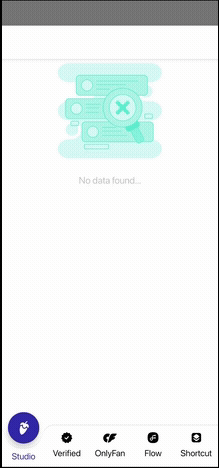

# React Native Custom Bottom Menu

[](https://www.npmjs.com/package/rn-bottom-menu) [](https://www.npmjs.com/package/rn-bottom-menu) 

A fast and intuitive bottom menu for React Native, designed for seamless navigation with customizable buttons and smooth animations. Perfect for creating engaging, responsive UI elements with minimal effort! 🔥

---



## Features

- Smooth interactions & animations.
- Supports dark/light Mode. 🌚 🌝
- Compatible with Cli.
- Written in `TypeScript`.

## Installation

```cmd
yarn add rn-bottom-menu
```
or

```cmd
npm i rn-bottom-menu
```

#### Dependencies

This library needs these dependencies to be installed in your project before you can use it:

```bash
yarn add react-native-reanimated react-native-gesture-handler @react-navigation/bottom-tabs @react-navigation/native d3-shape
```

**React Native Gesture Handler** needs extra steps to finalize its installation, please follow their [installation instructions](https://github.com/software-mansion/react-native-gesture-handler).

**React Native Reanimated** needs extra steps to finalize its installation, please follow their [installation instructions](https://docs.swmansion.com/react-native-reanimated/docs).

## USAGE

### `BottomNavigation`

Please check attached sample code to integrate rn-bottom-menu

```tsx
import { BottomNavigation } from 'rn-bottom-menu';


<Tab.Navigator
    screenOptions={{
      tabBarActiveTintColor: '#3030ae',
      tabBarInactiveTintColor: '#010101',
      tabBarActiveBackgroundColor: '#fff',
    }}
    tabBar={props => (
      <BottomNavigation
        mode={'default'}
        isRtl={false}
        focusedButtonStyle={{
          shadowOffset: { width: 0, height: 7 },
          shadowColor: '#fff',
          shadowOpacity: 0.41,
          shadowRadius: 9.11,
          elevation: 10,
        }}
        bottomBarContainerStyle={{
          position: 'absolute',
          bottom: 0,
          left: 0,
          right: 0,
        }}
        springConfig={{
          stiffness: 1500,
          damping: 85,
          mass: 4,
        }}
        {...props}
      />
    )}>
    <Tab.Screen
      name="Studio"
      options={{
        tabBarIcon: ({ focused }) => (
            //PUT YOUR BOTTOM MENU ICONS HERE
            //<SvgIcon
            //    pathFill={focused ? '#FFF' : '#000'}
            //    icon={SVGIcons.ICON2}
            //    {...scaled(23)}
            ///>
        ),
        tabBarLabel: 'Studio',
      }}
      component={<></>}
    />
    <Tab.Screen
      name="Verified"
      options={{
        tabBarIcon: ({ focused }) => (
            //PUT YOUR BOTTOM MENU ICONS HERE
        ),
        tabBarLabel: 'Verified',
      }}
      component={<></>}
    />
    <Tab.Screen
      name="OnlyFan"
      options={{
        tabBarIcon: ({ focused }) => (
            //PUT YOUR BOTTOM MENU ICONS HERE
        ),
        tabBarLabel: 'OnlyFan',
      }}
      component={<></>}
    />
    <Tab.Screen
      name="Flow"
      options={{
        tabBarIcon: ({ focused }) => (
            //PUT YOUR BOTTOM MENU ICONS HERE
        ),
        tabBarLabel: 'Flow',
      }}
      component={<></>}
    />
    <Tab.Screen
      name="Shortcut"
      options={{
        tabBarIcon: ({ focused }) => (
            //PUT YOUR BOTTOM MENU ICONS HERE
        ),
        tabBarLabel: 'Shortcut',
      }}
      component={<></>}
    />
  </Tab.Navigator>

```


## Contributors

- [Hardik Patel](mailto:hardik.patel.081990@gmail.com)
- For any customizations or changes, feel free to reach out to us at [hardik.patel.081990@gmail.com]. I'll be happy to assist you!

## License

[MIT](./LICENSE)

#### Show Your Support

Please give a star if you like this project! 🤩
